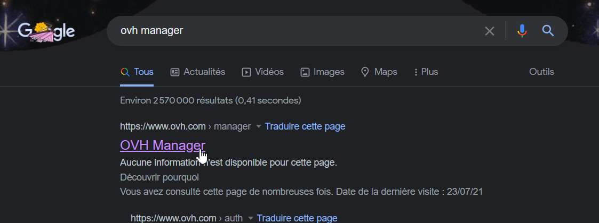
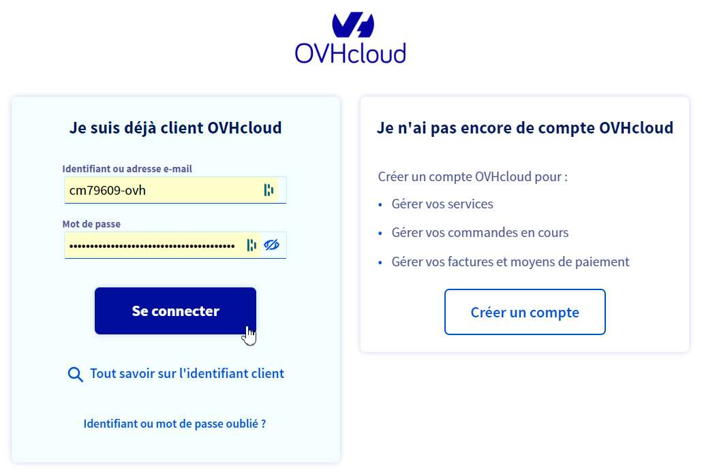
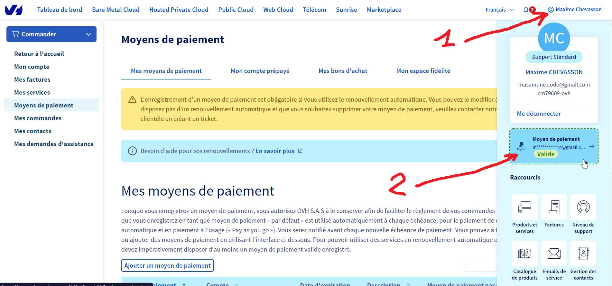
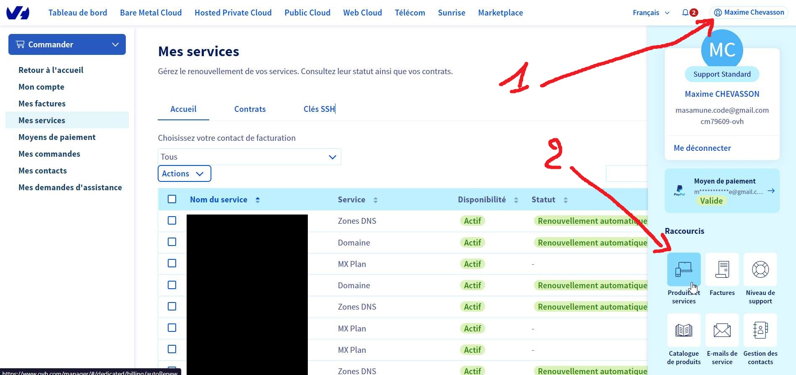
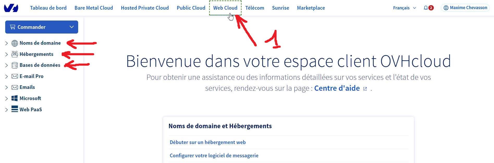

# Prise en main du manager OVH afin de gérer son hébergement

Heya, voici quelques captures d'écran afin de vous y retrouver dans la gestion de votre hébergement.

Ça reste impressionnant au début mais ce qu'il y a à retenir :

- Les deux principaux écrans sont "Moyens de paiement" et "Services" (~ liste des factures)
- En gros il y a deux factures
  - Une pour **l'hébergement**, à savoir le serveur, à savoir un ordinateur chez OVH qui met à disposition votre site sur une `adresse IP`, par exemple `142.142.142.142`
  - Une pour les **noms de domaines**, en gros ce qui "relie" le nom de votre site à l'adresse IP.
    - Par exemple quand je tape `masamune.fr` cela renvoie vers `142.142.142.142` (et donc le bon ordinateur et le bon site s'affiche)

Allez go pour les images

## Accéder à l'administration d'OVH "OVH Manager"

Sur google, chercher "OVH Manager"

---

Rentrer ses identifiants dans le formulaire de connexion

## La gestion des factures

Depuis le bouton de compte en haut à droite (avec noms & prénoms), vous pouvez accéder aux moyens de paiements...

---

... mais également aux services, en gros le détail des factures.

C'est également ici que vous pouvez gérer le renouvellement automatique (prélèvements, avec notifications ~1 mois à l'avance & le jour du prélèvement).

## Accéder aux trucs techniques

Dans le menu du haut, cliquer sur "Web cloud", tout est dedans

💡 À noter que pour les **hébergements persos & kimsufi**, l'accès à la base de données se trouve dans "Hébergements", et non dans "Base de données"

## Credits

Masamune / Maxime Chevasson

N'hésitez pas à revenir vers moi si vous avez des questions ;)
